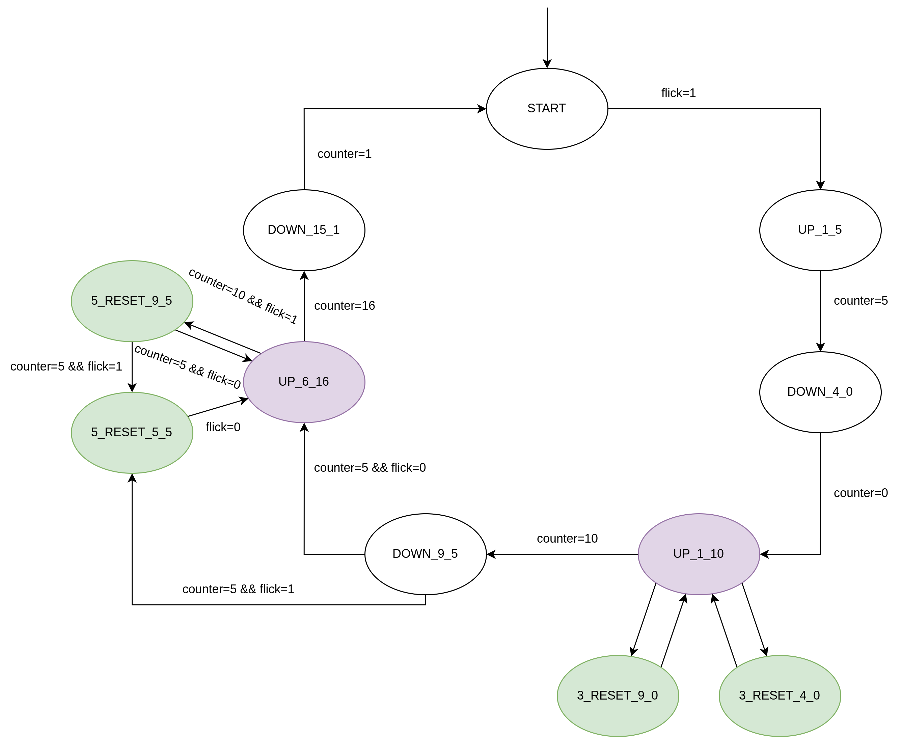
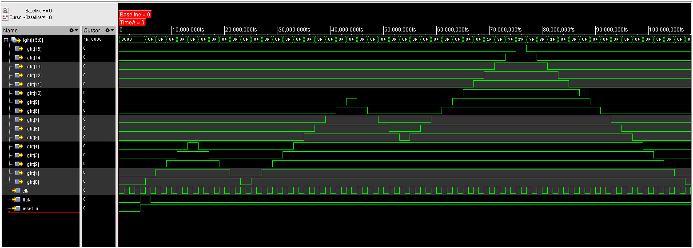

# Bound flasher

## Introduction

This repo contains implementation (admittedly not great) of the required bound flasher module.

Images will be put into the folder `image`

## Interface

| Signal | Width | In/out | Description |
| --- | --- | --- | --- |
| clk | 1 | Input | Provide clock (positive edge-triggered) |
| reset_n | 1 | Input | Provide asynchronous reset signal (active-low) |
| flick | 1 | Input | Control counting sequence of the module |
| light | 16 | Output | Output for the light (active-high) |

## Internal implementation

### Block diagram


The general idea of the module is that a FSM will control a up/down counter (with enable signal) to
count the current number of lights that are supposed to be turn on. The counter output will be
processed by a output decoder (light pattern decoder) to give the correct signal.

Within FSM, the enable and upcount (up/down count control) is generated from the `next_state` and
current `counter_val` input. Since the output state can be changed with both current state and
input, this is a Mealy state machine.

### State machine (of the FSM module)



The machine have 11 state, listed:

- `STATE_START`: Starting state of the machine

- `STATE_UP_1_5`: Stage 1 of the machine

- `STATE_DOWN_4_0`: Stage 2 of the machine

- `STATE_UP_1_10`: State 3 of the machine

- `STATE_DOWN_9_5`: State 4 of the machine

- `STATE_UP_6_16`: State 5 of the machine

- `STATE_DOWN_15_1`: State 6 of the machine

- `STATE_3_RESET_9_0`: Entered at the 10th light kickback point within stage 3, if flick=1

- `STATE_3_RESET_4_0` : Entered at the 5thlight kickback point within stage 3, if flick=1

- `STATE_5_RESET_9_5` : Entered at the 10th light kickback point within stage 5, if flick=1

- `STATE_5_RESET_5_5` : Entered at the 5th light kickback point within stage 5, if flick=1

With 2 variable:

- flick (from input `flick`)
- counter (from input `counter_val`)

## Simulation

Within the testbench file `BoundFlasher_tb.v`, code for generating test signal pattern is divided
into 3 seperate section, with each corresponding to a specific test of the `BoundFlasher` module.

1. Normal operation without flick signal interruption

2. Flick active at the reset point of `STATE_UP_1_10`, testing both condition of 5 lights and 10
   lights

3. Flick active at the reset point at state `STATE_UP_6_16` and state `STATE_DOWN_9_5`, testing both
   condition of 5 lights and 10

### Normal flow (test part 1)



Verilog snippet for generating the input signal is showed below:

```verilog
// reset the thing
clk <= 0;
reset_n <= 0;
flick <= 0;
#4;

// start counting normally for a cycle (no reset state)
reset_n <= 1;
flick <= 1;
#2;
flick <= 0;
#106;
```

Here we see the `BoundFlasher` module going through all 6 of its stages in a normal, uninterrupted
flow. At the start of the simulation, we pull the `reset_n` signal low for some clock cycle,
effectively resetting the module to the start state. After that, `reset_n` is released to let the
module work normally.

### Flick active (test part 2)


Below is the generating code for testing part 2. We quickly set the module (and its submodule) to
the appropriate state just before the reset point. This phase spans the timeframe from 110fs to
about 165fs showed in the simulation waveform.

```verilog
// test reset state from STATE_UP_1_10
// setting the internal node to correct value for quick testing
UUT.counter.out = 4;
UUT.control_fsm.current_state = UUT.control_fsm.STATE_UP_1_10;
flick = 1;
#4;
flick = 0;
#24;
flick = 1;
#10;
flick = 0;
#20;
```

From about 110fs (or more correctly 110 delay after the simulation start). We start to test flick
'reset' state. The reason they are called 'reset state' is because on activation of such a condition
(light count is at 5 or 10; flick is active), the current state will be reset - meaning that the
module will slowly going back to the starting condition of that state and then repeat as if the
state has never been entered. 

Testing the first kickback point (5 lights) is done from 110fs to about 125fs. After that is the
testing of the second kickback point (10 lights). Though the effect of this kickback point is hard
to observe with waveform alone, so a excerpt of the simulation print-out is provided below to
confirm that such a state changed happened (from `STATE_UP_1_10` to `STATE_3_RESET_9_0` and back -
note the second last column showing the state decoded as number).

```
  T	clk	reset_n	flick	light
125	1	1	0	0000000000000001	 3, 1
126	0	1	0	0000000000000001	 3, 1
127	1	1	0	0000000000000011	 3, 2
128	0	1	0	0000000000000011	 3, 2
129	1	1	0	0000000000000111	 3, 3
130	0	1	0	0000000000000111	 3, 3
131	1	1	0	0000000000001111	 3, 4
132	0	1	0	0000000000001111	 3, 4
133	1	1	0	0000000000011111	 3, 5
134	0	1	0	0000000000011111	 3, 5
135	1	1	0	0000000000111111	 3, 6
136	0	1	0	0000000000111111	 3, 6
137	1	1	0	0000000001111111	 3, 7
138	0	1	0	0000000001111111	 3, 7
139	1	1	0	0000000011111111	 3, 8
140	0	1	1	0000000011111111	 3, 8
141	1	1	1	0000000111111111	 3, 9
142	0	1	1	0000000111111111	 3, 9
143	1	1	1	0000001111111111	 3,10
144	0	1	1	0000001111111111	 3,10
145	1	1	1	0000000111111111	 7, 9
146	0	1	1	0000000111111111	 7, 9
147	1	1	1	0000000011111111	 7, 8
148	0	1	1	0000000011111111	 7, 8
149	1	1	1	0000000001111111	 7, 7
150	0	1	0	0000000001111111	 7, 7
151	1	1	0	0000000000111111	 7, 6
152	0	1	0	0000000000111111	 7, 6
153	1	1	0	0000000000011111	 7, 5
154	0	1	0	0000000000011111	 7, 5
155	1	1	0	0000000000001111	 7, 4
156	0	1	0	0000000000001111	 7, 4
157	1	1	0	0000000000000111	 7, 3
158	0	1	0	0000000000000111	 7, 3
159	1	1	0	0000000000000011	 7, 2
160	0	1	0	0000000000000011	 7, 2
161	1	1	0	0000000000000001	 7, 1
162	0	1	0	0000000000000001	 7, 1
163	1	1	0	0000000000000000	 7, 0
164	0	1	0	0000000000000000	 7, 0
165	1	1	0	0000000000000001	 3, 1
166	0	1	0	0000000000000001	 3, 1
```

# Flick active (test part 3)

This testing spans from about 165fs to the end. The input generating code is 

```verilog
// test reset state from STATE_UP_6_16 and STATE_DOWN_9_5
// setting the internal node to correct value for quick testing
UUT.counter.out = 6;
UUT.control_fsm.current_state = UUT.control_fsm.STATE_DOWN_9_5;
flick = 1;
#10;
flick = 0;
#5;
flick = 1;
#20;
flick = 0;
#20;
```

And the associated excerpt from simulation print-out

```
  T	clk	reset_n	flick	light
165	1	1	0	0000000000000001	 3, 1
166	0	1	0	0000000000000001	 3, 1
167	1	1	0	0000000000000011	 3, 2
168	0	1	0	0000000000000011	 3, 2
169	1	1	0	0000000000000111	 3, 3
170	0	1	1	0000000000111111	 4, 6
171	1	1	1	0000000000011111	 4, 5
172	0	1	1	0000000000011111	 4, 5
173	1	1	1	0000000000011111	10, 5
174	0	1	1	0000000000011111	10, 5
175	1	1	1	0000000000011111	10, 5
176	0	1	1	0000000000011111	10, 5
177	1	1	1	0000000000011111	10, 5
178	0	1	1	0000000000011111	10, 5
179	1	1	1	0000000000011111	10, 5
180	0	1	0	0000000000011111	10, 5
181	1	1	0	0000000000111111	 5, 6
182	0	1	0	0000000000111111	 5, 6
183	1	1	0	0000000001111111	 5, 7
184	0	1	0	0000000001111111	 5, 7
185	1	1	1	0000000011111111	 5, 8
186	0	1	1	0000000011111111	 5, 8
187	1	1	1	0000000111111111	 5, 9
188	0	1	1	0000000111111111	 5, 9
189	1	1	1	0000001111111111	 5,10
190	0	1	1	0000001111111111	 5,10
191	1	1	1	0000000111111111	 9, 9
192	0	1	1	0000000111111111	 9, 9
193	1	1	1	0000000011111111	 9, 8
194	0	1	1	0000000011111111	 9, 8
195	1	1	1	0000000001111111	 9, 7
196	0	1	1	0000000001111111	 9, 7
197	1	1	1	0000000000111111	 9, 6
198	0	1	1	0000000000111111	 9, 6
199	1	1	1	0000000000011111	 9, 5
200	0	1	1	0000000000011111	 9, 5
201	1	1	1	0000000000011111	10, 5
202	0	1	1	0000000000011111	10, 5
203	1	1	1	0000000000011111	10, 5
204	0	1	1	0000000000011111	10, 5
205	1	1	0	0000000000011111	10, 5
206	0	1	0	0000000000011111	10, 5
207	1	1	0	0000000000111111	 5, 6
208	0	1	0	0000000000111111	 5, 6
209	1	1	0	0000000001111111	 5, 7
210	0	1	0	0000000001111111	 5, 7
211	1	1	0	0000000011111111	 5, 8
212	0	1	0	0000000011111111	 5, 8
213	1	1	0	0000000111111111	 5, 9
214	0	1	0	0000000111111111	 5, 9
215	1	1	0	0000001111111111	 5,10
216	0	1	0	0000001111111111	 5,10
217	1	1	0	0000011111111111	 5,11
```

The process of testing is similar to the previous part: setting the state to near activation point
and observe the output.

We first set the module to state `STATE_DOWN_9_5` with light count near 5 to preparing transitioning
into the `STATE_5_RESET_5_5` state. Such a state will not be escape if flick is not deasserted.
Exactly because of that, we keep flick asserted for some cycle to test that. Then flick is
deasserted to let the system change back into `STATE_UP_6_16` and counting up until 10 lights is
active.

We then activete the flick input again for the kickback point of 10 lights. Letting the system count
back to 5 and stuck at `STATE_5_RESET_5_5` for a from cycle until we release flick so that the
module count normally again.
